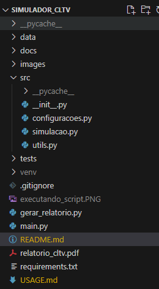
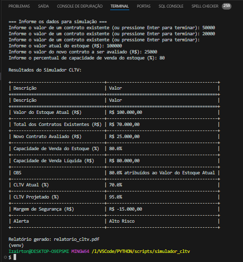

# 📊 **Simulador CLTV Empresarial**

Bem-vindo ao **Simulador CLTV Empresarial**! 🚀  
Este projeto aplica o conceito de **CLTV (Combined Loan-to-Value)**, conhecido no mercado imobiliário, para analisar o **risco financeiro empresarial**. Utilizando **Python**, desenvolvemos um script que automatiza cálculos, gera relatórios profissionais e facilita a tomada de decisões financeiras.

## 🎯 **Objetivos do Projeto**

- Adaptar o conceito de **CLTV** para o **setor empresarial**.
- Automatizar cálculos financeiros e gerar insights sobre riscos de endividamento.
- Fornecer uma solução prática para gestores avaliarem contratos usando o estoque como garantia.
- Criar relatórios em PDF de forma clara e profissional.

## 📁 **Estrutura de Pastas**

## 🛠️ **Tecnologias Utilizadas**

- **Python 3.9+**: Linguagem base para todo o projeto.
- **Pillow**: Para manipulação de imagens, se necessário.
- **FPDF**: Para gerar relatórios em PDF.
- **Tabulate**: Para exibir dados em formato tabular no terminal.
- **Locale**: Para formatação monetária no estilo brasileiro.

## 📝 **Como Usar**

### **1. Pré-requisitos**

- Tenha o Python 3.9 (ou superior) instalado.
- Instale as dependências do projeto:

  pip install -r requirements.txt

### **2. Executando o Projeto**

1. Navegue até o diretório do projeto:

   cd simulador_cltv

2. Execute o arquivo principal:

   python main.py

3. Insira os dados solicitados no terminal, como:
   - Valores dos contratos existentes.
   - Valor atual do estoque.
   - Valor do novo contrato avaliado.
   - Capacidade de venda do estoque (%).

4. Confira os resultados:
   - Tabela exibida no terminal.
   - Relatório gerado no arquivo **relatorio_cltv.pdf**.

## 📂 **Exemplo de Saída no Terminal**

Resultados do Simulador CLTV:

## 📄 **Exemplo de Relatório PDF**

- **Cabeçalho:** Local, data e destinatário.
- **Resultados:** Tabela com todas as métricas calculadas.
- **Parecer Técnico:** Análise detalhada e recomendações.
- **Assinatura:** Nome do analista responsável.

## 🤝 **Contribuições**

Adoramos colaborações! Se quiser contribuir, siga os passos abaixo:

1. Faça um fork do repositório.
2. Crie uma nova branch:

   git checkout -b minha-melhoria

3. Faça suas alterações e commit:

   git commit -m "Adiciona nova funcionalidade"

4. Envie as alterações:

   git push origin minha-melhoria

5. Abra um **Pull Request**.

## 📧 **Contato**

- Autor: Izairton Vasconcelos
- E-mail: (<iovascon@gmail.com>)
- LinkedIn: [Izairton Vasconcelos](www.linkedin.com/comm/mynetwork/discovery-see-all?usecase=PEOPLE_FOLLOWS&followMember=izairton-oliveira-de-vasconcelos-a1916351)

> **Nota:** Este projeto foi desenvolvido com o objetivo de demonstrar a viabilidade de aplicar o conceito de CLTV no setor empresarial, automatizando análises financeiras com Python. 🚀
